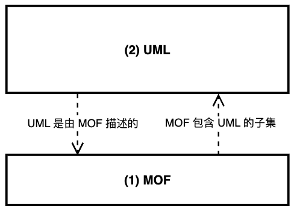
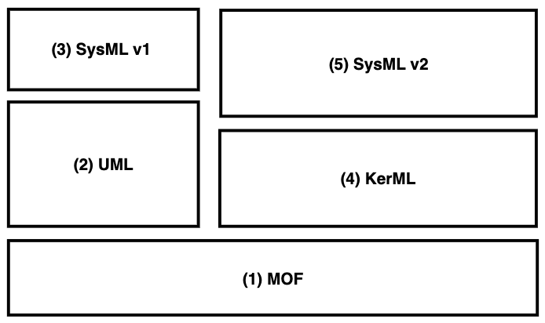
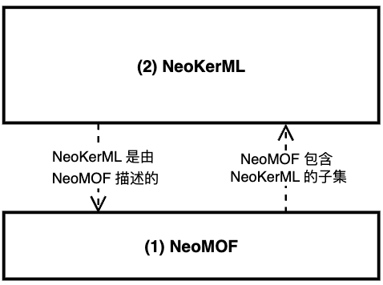
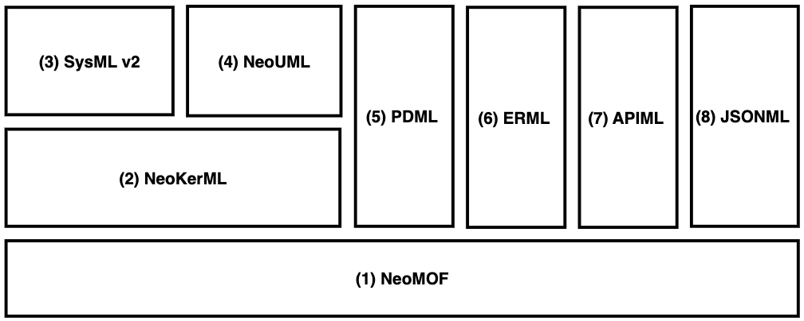

# NeoMLs
A set of next-generation modeling languages built on KerML.  Its immediate purpose is to provide textual model notations for AI-driven software engineering.

一组基于 KerML 的新一代建模语言。其直接目的是为 AI 驱动的软件工程提供文本化的模型表示法。

This project reconstructs MOF, KerML, UML and other modeling languages based on KerML. Once OMG publishes official KerML-native standards, this repository will be archived.

本项目将基于 KerML 重新构建 MOF、KerML、UML 及其他建模语言。一旦 OMG 官方正式发布了基于 KerML 的原生标准，本仓库将完成历史使命 ：）。

## 问题

围绕 AI 的软件工程，需要将领域模型文本化。
领域建模的标准做法是UML，因此需要将 UML 文本化。
社区早已经有这种尝试，尽管之前不是为了 AI。例如 Plant UML。
OMG官方只有XMI,难以被人直接阅读和修改。

2025年9月，OMG 正式发布了 **Kernel Modeling Language™ (KerML™) Verson 1.0** 和 **OMG Systems Modeling Language™
(SysML®) Version 2.0** (简称 SysML v2)。将文本表示法作为建模语言的首要表示法，而不像UML那样以模型图为先。这为 UML 的文本化带来一线曙光。

然而，OMG 官方并没有再接再厉，将 UML 也用 KerML 重建。因此目前 UML 并没有官方的文本表示标准。

## 现状

KerML 的产生，本来是为了解决 UML 长期依赖存在的根本问题，因此才另起炉灶。但 KerML 本身的的抽象语法仍然使用了UML。因此并未彻底斩断和 UML 的期待。这是因为，KerML 是基于 MOF (Meta Object Facility) 的，而 MOF 又是使用 UML 来描述的。

目前，MOF 和 UML 的关系如下图：

  

1. MOF 是 OMG 用于描述元模型的“元元模型”的规范。UML元模型就是用 MOF 描述的。那么，OMG 自身有时用什么描述的呢？答案是 UML。事实上，MOF 包括了 UML 的一个很小的子集，以及少许专用于元元模型的特有内容。这个小子集是 UML 类图的一部分，已经足以描述 MOF 自身以及以 MOF 为基础的所有元模型了。于是可以说 MOF 用自己描述了自己，实现了“自举”（bootstrapping）。
1. 图中的 UML，其实是“UML元模型”的简称。UML 是用 MOF 来描述的。准确地说，UML 是用 MOF 中包含的 UML 子集来描述的。也就是 UML 间接地用自己描述了自己，从而实现了 UML 的“自举”（bootstrapping）。

 尽管 UML 和 MOF 互相依赖，但由于 MOF 是元元模型，处于基础层面，因此画在图的下方。UML画在上方，表示基于 MOF 建立的元模型。

目前 OMG 各建模语言规范的关系如下图：

  

## 远景

理想状态下，MOF 和 KerML 的关系应该如下图：

  

理想状态下，各建模语言规范的关系应如下图：

  

## 路线图

bootstrapping

